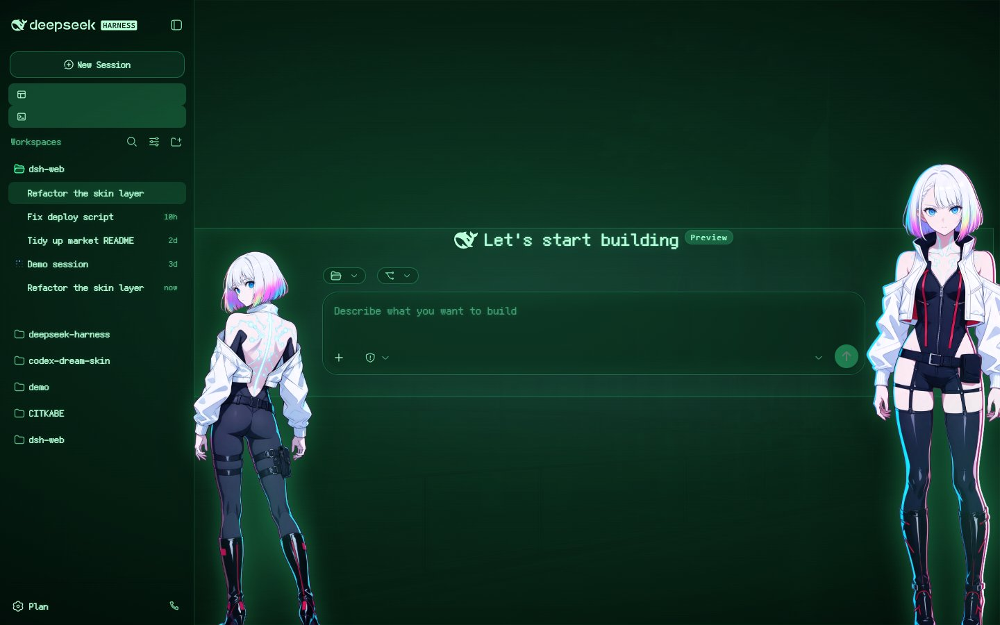

# 磷光 CRT — DSH 皮肤

[English](README.md) | 中文

把 DeepSeek Harness 的 Web GUI 变成一台老式磷光管显示器：暗玻璃上的绿色等宽文字、**中英文都覆盖**的点阵字体、窗外城市渲染成 P1 磷光，两个网络行者立绘依旧钉在输入框的左右两沿。

| | |
| --- | --- |
| 皮肤 id | `crt-phosphor` |
| 版本 | 0.1.0 |
| 清单 | v2（皮肤中心契约） |
| 针对版本 | DSH 0.2.0-rc.2 桌面版 + `@linxin666/dsh-client-ui-skin-center` 0.4.3 |
| 字体 | Fusion Pixel 12px 等宽（OFL-1.1，随皮肤打包） |
| 许可 | CC BY-NC-SA 4.0（非官方同人作品） |

## 效果

亮色 —— 同一根管子，亮度开大一点：



暗色 —— 更深的玻璃、更亮的磷光：


两张都是 1440x900、JPEG q85，用创意工坊画廊那套官方 facade 渲染器出的。

## 安装

```powershell
git clone https://github.com/lemonhall/dsh-skin-crt
Copy-Item -Recurse dsh-skin-crt\skins\crt-phosphor "$env:USERPROFILE\.dsh\skins\"
```

然后 设置 → 皮肤中心，选 `磷光 CRT`。皮肤中心在卡片打开时会重扫 `$DSH_HOME/skins`，在 GUI 里切换不需要刷新或重启。

## 到底靠什么做出"CRT"

四层，按重要性排：

1. **背景本身就是被点亮的磷光。** `tools/build_crt_assets.py` 取一张无人物夜景，把亮度映射到三段式 P1 磷光色谱上，再把高光模糊一份回来做 screen 混合（halation），最后**烘焙**扫描线、暗角与细微颗粒。烘焙胜过 CSS 现画：3px 周期的 CSS 扫描线会和设备像素比打架，看上去就是几条粗带在屏幕上扫（见 `docs/CRT-TECHNIQUE.md`）。
2. **一层 token 就把整个界面重新上色 + 换字。** `skin.css` 重映射官方 `--dsw-*`：所有文字与描边换成磷光绿，所有面板换成近黑的绿玻璃，31 个 `--dsw-font-*-font-family` 全部指向随包的点阵字。
3. **三层自由选择器画出管子。** `patches.css`：`#root::before` 负责暗角 + 缓慢呼吸，`#root::after` 负责淡淡的整屏辉光 + 极偶发的浅闪烁，正文再叠磷光泛光与一丝色差边缘。
4. **立绘挂在输入框上。** `body::before/::after` 锚定 `[data-composer-card]`（左立绘用 `left: anchor(--crt-composer left)` 配 `translate: -100% 0`），所以侧栏与 details 栏开合时**两人都会跟着走**，全程不需要测量。层级 `z-index: 900`：高于所有官方面板、低于鲸鱼娘挂件的 `9999`。

## 中文这道坎，以及字体选择

经典 DOS 味来自 IBM VGA 8x16 那类位图字体（Ultimate Oldschool PC Font Pack）。但它们**只覆盖 CP437**（拉丁 + 制表符）：一旦把整个界面指向它，每个汉字都会掉到现代回退字体上——而这个界面主要就是中文，幻觉恰好破在最关键的地方。

DOS 时代中文的正解是 16×16 点阵字库（HZK16 那一类），纯点阵数据、没有 webfont 形态。现实可行的等价物是 **Fusion Pixel 12px 等宽**（[TakWolf/fusion-pixel-font](https://github.com/TakWolf/fusion-pixel-font)，OFL-1.1），拉丁与简体中文在同一套点阵网格上。它的许可原文随皮肤一起放在 `assets/FUSION-PIXEL-OFL.txt`。

两条"皮肤里塞字体"的实测结论：

- 只要 URL 是**本地相对路径**（`url("assets/…woff2")`），`@font-face` 就能过皮肤中心的 CSS 安全管线；远程与协议 URL 会被拒。无选择器的 at-rule 能存活，`@keyframes` 早就验证过。
- 这个字体占了皮肤总体积（约 1.3 MB）里的 903 KB。按常用汉字子集化能砍掉大约一半，但全量能保证生僻字不塌。

## 仓库结构

```
skins/crt-phosphor/          皮肤本体 —— 被安装的就是这个目录
  skin.json                  v2 清单（+ 磷光场景作为 backgroundMedia）
  skin.css                   L1 token：配色、31 个 font-family、@font-face
  patches.css                L3：管子分层、磷光泛光、两个立绘
  assets/                    场景、立绘、字体与其 OFL 许可
  preview/                   light.jpg + dark.jpg，1440x900 JPEG q85
  README.md / README.zh.md   皮肤自带的中英说明
docs/CRT-TECHNIQUE.md        分层设计、摩尔纹教训、管线事实
tools/build_crt_assets.py    亮度→P1 色谱、halation、烘焙扫描线
tools/wire_pixel_font.py     把随包字体接进 skin.css
tools/inject_skin_into_facade.py  把任意皮肤注入官方 facade 渲染器
tools/capture_facade.cjs     用 Playwright 出 1440x900 预览
_vendor/                     上游下载归档（不入库）
```

## 仓库里的两个版本

本仓库的 `skins/crt-phosphor/` 带可选的可交互 `hooks.mjs`：点任一位小姐姐，她会随机回一句（气泡是 DOM，因此无论文字多长都停在**头顶上方**）。投给创意工坊的版本**不带 hooks** —— 皮肤契约明确把 `facets.client` 保留给内置皮肤，且写明不会成为"仓库外可执行扩展"的入口。

本地要让 hooks 生效，安装目录里需要有 `dsh-market.provenance.json`；它到底是什么、意味着什么，见 `tools/make-local-provenance.mjs` 与 `docs/CRT-TECHNIQUE.md` 的 Lesson 6。

## 验证

| 门禁 | 结果 |
| --- | --- |
| `node scripts/dsh-skin.cjs validate skins/crt-phosphor` | PASS（一条预期内的 `[class*=]` 哈希类名警告） |
| 皮肤中心 `…/crt-phosphor/stylesheet` | 200，`@font-face` 在位、本地字体 URL 未被改写 |
| 皮肤中心 `…/crt-phosphor/patches` | 200 |
| 实机 | `data-dsh-skin=crt-phosphor`，`document.fonts.check("12px \"Fusion Pixel 12px\"") === true` |
| 实机分层 | `#root::before` 动画 `crt-breathe`、`#root::after` `crt-flicker`，CSS 层已无扫描线渐变 |

## 已知取舍

- 字体按 12px 网格设计；界面里那些奇数号（11、13、14、16）会被 Chromium 插值一点，所以少数标签比原生点阵格略软。把所有字号 token 统一钉到 12px 网格能变得极锐利，代价是偏离官方排版刻度。
- `patches.css` 有几处匹配 CSS-Modules 哈希类名（`*_frame`、`*_sidebarCol`），`dsh-skin validate` 会按设计给出 warning：官方重建后类名可能变化。
- 右栏展开时右立绘站在栏上 —— 刻意取舍，另一种选择是让她消失。
- 立绘沿用 Lucy 皮肤那套抠好的素材，因此继承了她的角色设定；`--crt-portrait-filter` 一行就能在她"自然色"与"纯磷光幽灵"之间切换。

## 许可与溯源

CC BY-NC-SA 4.0 —— 必须署名、非商业、相同方式共享。随包字体为 OFL-1.1，保留其自身许可。人物与世界观归其权利方所有；本作品为非官方同人，与 CD Projekt Red / Studio Trigger 无关。详见 [NOTICE](NOTICE) 与 [LICENSE](LICENSE)。
